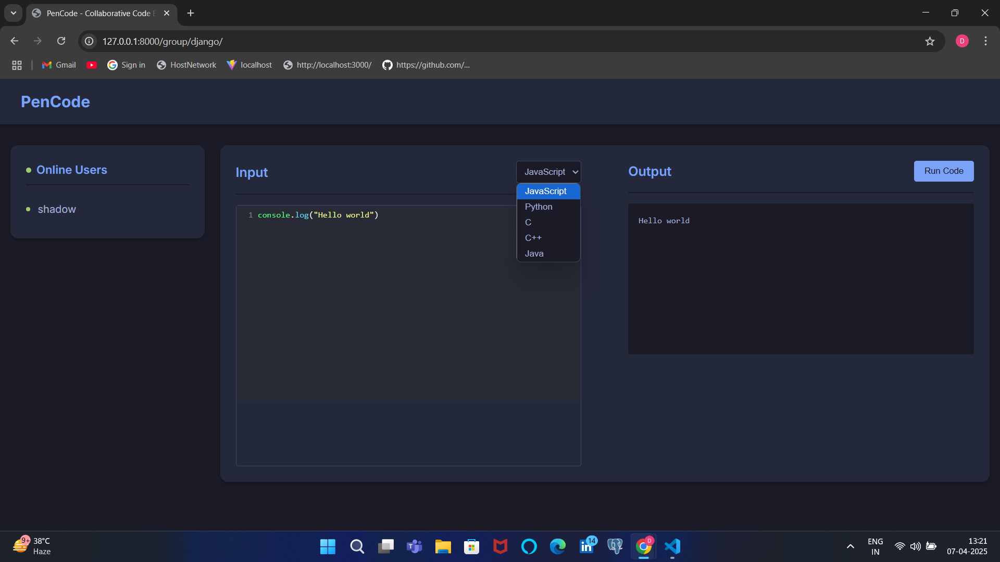
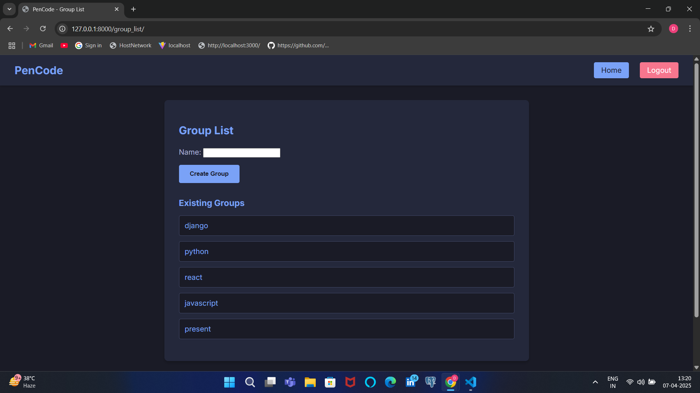
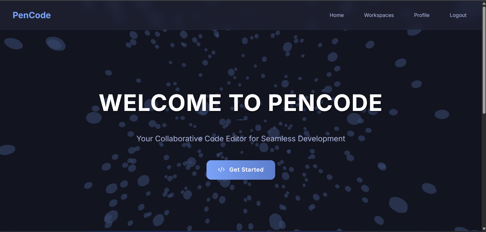
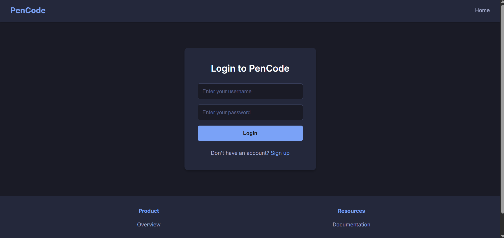
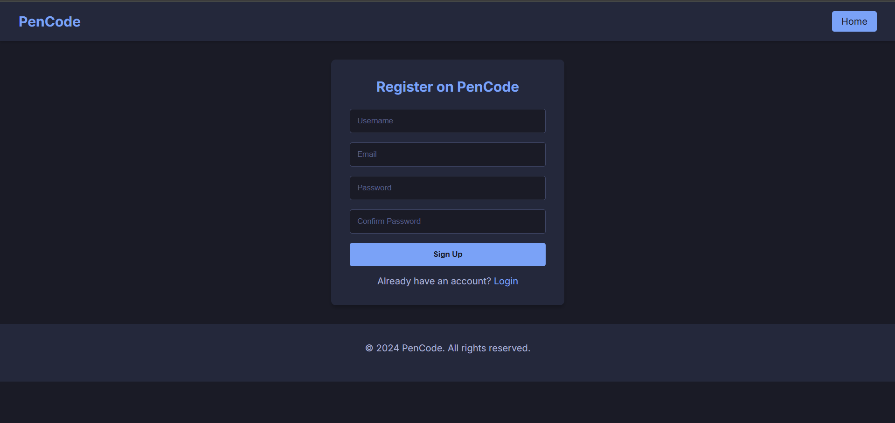
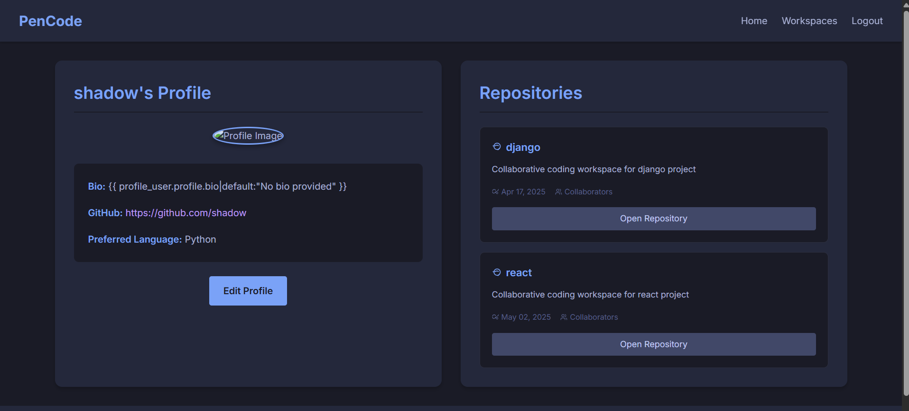
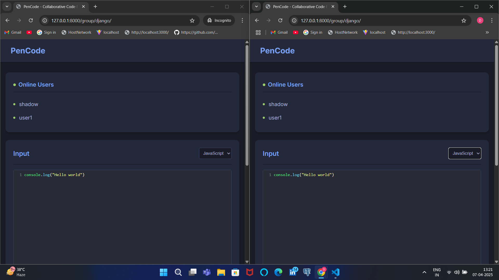

# PenCode - Real-Time Collaborative Pair Programming Platform 🚀

PenCode is a web-based platform specifically designed to enhance remote pair programming experiences through real-time collaboration, synchronized code editing, and integrated communication tools. This project aims to improve code quality, accelerate learning, and enhance productivity for both educational and professional settings.


_Figure 1: PenCode Editor Pane (code playground)_

## ✨ Key Features

- **🔄 Real-Time Code Synchronization**: Seamless bi-directional code editing using WebSockets
- **👥 Pair View Modes**:
  - Split-Screen Mode: Both users can see each other's cursors and changes
  - Single-Editor Mode: One user edits while the other observes
- **🛠️ Automated Code Review**: Real-time syntax checking and error detection
- **🌈 Syntax Highlighting**: Support for multiple programming languages
- **🔊 Communication Tools**: Integrated chat functionality to keep conversations within the workspace
- **📊 Session Management**: Each coding session has a unique shareable link
- **🔐 Authentication System**: User registration and login functionality
- **👨‍💻 Group Management**: Create and join different coding groups
- **▶️ Code Execution**: Run your code directly in the browser


_Figure 2: Group List Interface_


_Figure 3: PenCode Home Page_


_Figure 4: User Login Interface_


_Figure 5: User Registration Interface_


_Figure 6: User Profile Management_

## 🧪 Pilot Study Results

Based on our pilot study with 20 participants including students and professional developers:

| **Metric**                         | **Before PenCode** | **With PenCode** | **Improvement (%)** |
| ---------------------------------- | ------------------ | ---------------- | ------------------- |
| **Task Completion Time** (minutes) | 45 min             | 30 min           | **33% Faster**      |
| **Code Quality Score** (out of 10) | 6.5                | 8.2              | **26% Increase**    |
| **User Satisfaction** (out of 5)   | 3.2                | 4.6              | **44% Higher**      |

## 🌐 Supported Languages

- JavaScript (executed in-browser)
- Python
- Java
- C
- C++

## 🛠️ System Architecture

### Tech Stack

- **Frontend**: HTML with Django templates, CSS, vanilla JavaScript, Three.js (for 3D effects)
- **Backend**: Django, Django Channels
- **Real-time Communication**: WebSockets
- **Code Editor**: Customized version of CodeMirror
- **Code Execution**: Piston API (emkc.org)

### Data Flow

1. User A types code, sending an event to the server through WebSocket
2. The server processes and broadcasts this event to User B
3. User B's interface updates to reflect the changes in real-time


_Figure 7: Two users working on the same codebase/project_

## 📦 Installation

1. Clone the repository:

```bash
git clone https://github.com/sujal-bansal/Code-Collab-Platform.git
cd Code-Collab-Platform
```

2. Create and activate a virtual environment:

```bash
python -m venv venv
source venv/bin/activate  # On Windows: venv\Scripts\activate
```

3. Install dependencies:

```bash
pip install -r requirements.txt
```

4. Set up the database:

```bash
python manage.py migrate
```

5. Create a superuser:

```bash
python manage.py createsuperuser
```

6. Run the development server:

```bash
python manage.py runserver
```

7. Visit `http://127.0.0.1:8000` in your browser.

## 📁 Project Structure

```
pencode/
├── core/                   # Main app directory
│   ├── consumers1.py       # WebSocket consumer for real-time code editing
│   ├── forms.py            # User registration and group forms
│   ├── models.py           # Database models for Code and Group
│   ├── routing.py          # WebSocket routing configuration
│   ├── urls.py             # URL configurations
│   ├── views.py            # View functions
│   └── templates/core/     # HTML templates
│       └── dark_working.html # Main code editor template
├── static/                 # Static files (CSS, JS)
└── pencode/               # Project settings directory
```

## 📝 User Interface Components

### Editor Pane

The central area for code input with syntax highlighting and real-time synchronization.

### Communication Panel

Contains chat and video options, keeping conversations within the same workspace.

### Project Explorer

Provides access to project files, allowing easy navigation between files.

### Group Lists

Lists all the groups/projects and lets users create new ones.

## 🔌 WebSocket Integration for Synchronization

The WebSocket server manages the session state and broadcasts changes to all connected users. This ensures:

- Low latency communication
- Real-time collaborative experience
- Instant reflection of changes across all clients

## 🔒 Security and Session Management

- Encrypted WebSocket connections
- Session tokens for user authentication
- Temporary session storage (code is not stored permanently unless specified)
- Privacy protection measures

## 🔮 Future Development Plans

1. **Frontend Architecture Overhaul**:

   - Migrating from HTML with Django templates to React.js
   - Improving code organization, reusability, and maintainability

2. **Integrated Communication**:

   - Adding built-in audio and video communication capabilities
   - Eliminating the need for external applications during collaboration

3. **Microservices Architecture**:
   - Transitioning from monolithic to microservices approach
   - Creating dedicated services for authentication, session management, and real-time synchronization
   - Enhancing scalability, resilience, and modularity

## 🤝 Contributing

1. Fork the repository
2. Create your feature branch (`git checkout -b feature/amazing-feature`)
3. Commit your changes (`git commit -m 'Add some amazing feature'`)
4. Push to the branch (`git push origin feature/amazing-feature`)
5. Open a Pull Request

## 📄 License

This project is licensed under the MIT License - see the LICENSE file for details.

## 🙏 Acknowledgements

- [Django](https://www.djangoproject.com/)
- [Django Channels](https://channels.readthedocs.io/)
- [CodeMirror](https://codemirror.net/)
- [Piston API](https://github.com/engineer-man/piston)
- [Three.js](https://threejs.org/)

## 📚 References

For a complete list of academic references and technical details, please refer to our [research paper](link-to-paper).
